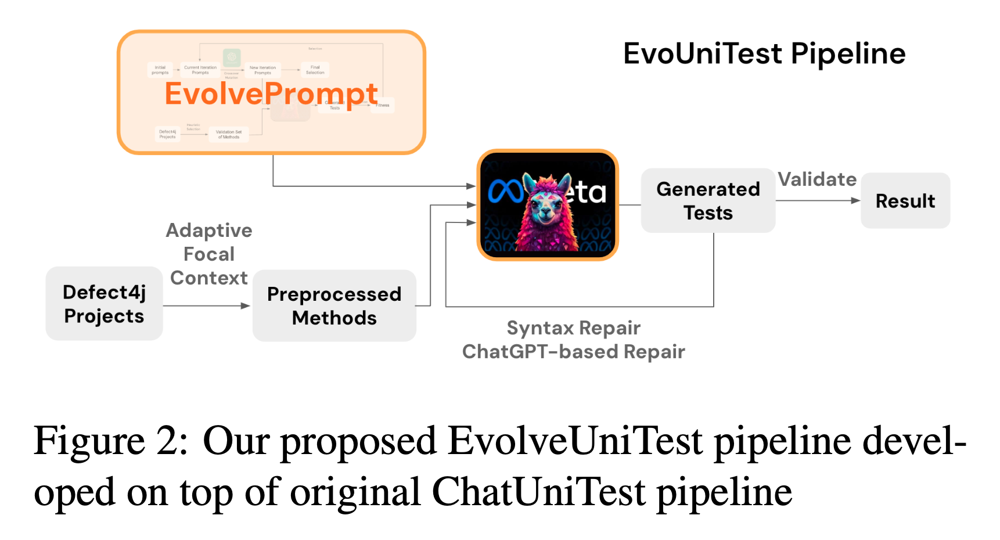
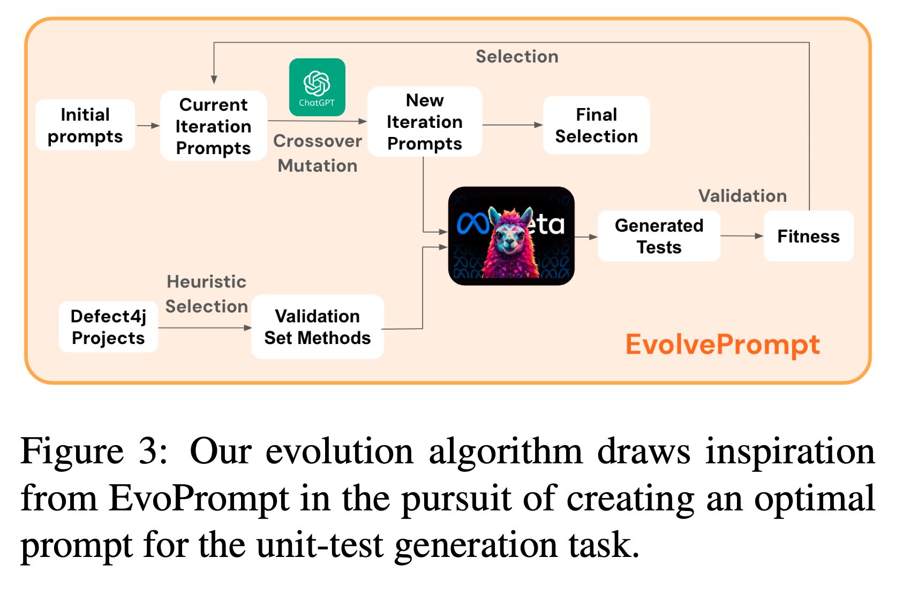

# EvolveUniTest : Evolving Prompt with Genetic Algorithm Yields Powerful Instruction for Unit Test Generation
[[`Slides`](https://docs.google.com/presentation/d/1RMA-35Qafz4ZkoMB837EVmLxZn1hSpCe7plRxkqejRw/edit?usp=sharing)]
[[`Paper`](https://github.com/s6007541/EvolveUniTest/blob/main/pdf_files/EvolveUniTest.pdf)] 

> Contributors: Pawit Wangsuekul, Sorn Chottananurak, Hai-Nam V. Cao, Thanh-Long V. Le


Built on top of [ChatUniTest](https://github.com/ZJU-ACES-ISE/ChatUniTest)


## Abstract

Unit testing is a crucial aspect of software engineering, demanding considerable time and effort. To address this challenge, various automated test generation tools have been developed, such as ChatUniTest — a ChatGPT-based system developed under the Generation-Validation-Repair framework. Despite its utility, ChatUniTest's performance is hampered by the reliance on manually crafted system prompts to initiate the test generation process. Drawing inspiration from recent researches in prompt evolution, we introduce EvolveUniTest, an adaptation of ChatUniTest with EvolvePrompt, a framework employing genetic algorithms for prompt evolution. EvolvePrompt initiates from a population of system prompts, including those manually designed for ChatUniTest, iteratively generating new prompts using a large language model and enhancing the population based on a development set. Leveraging the most optimized prompt from this evolutionary process, EvolveUniTest surpasses ChatUniTest in the quality and performance of generated unit tests. It achieves higher correctness percentages, increased branch and line coverage, and improved focal method coverage.

<p align="center">

</p>

<p align="center">

</p>


## Related Work
- [ChatUniTest: a ChatGPT-based automated unit test generation tool](https://arxiv.org/abs/2305.04764)
- [Connecting Large Language Models with Evolutionary Algorithms Yields Powerful Prompt Optimizers](https://arxiv.org/abs/2309.08532)

## Usage

### Step 1: Installation
First make sure you run this program in Mac or Linux system with mysql installed.

Follow the instructions below to install the project:

1. Clone the project: `git clone https://github.com/s6007541/EvolvePrompt.git`
2. Enter the project directory: `cd EvolvePrompt`
3. Install the requirements: `pip install -r requirements.txt`

### Step 2: Download the LLM
We use **CodeLlama-7b-Instruct** for unit test generation in this project. Follow the instruction given in [the offical CodeLlama repository](https://github.com/facebookresearch/codellama?tab=readme-ov-file#download) to download it.

### Step 3: Configuration

The configuration files are provided at `.config/config_evoprompt.ini` and `.config/config_chatunitest.ini`.

You need to alter few options:

1. `project_dir`: path to compiled Java project. (The path must be in English)
2. `model_path`, `tokenizer_path`
3. `api_keys`
4. `host`, `port`, `database`, `user`, `password`
5. `GRAMMAR_FILE`: tree-sitter java grammar file.

The options are explained as follows:

```ini
[DEFAULT]
test_number = 3 # The number of attempts to generate for each focal method.
process_number = 32 # The number of processes to use when generating tests.
dataset_dir = ../dataset/ # Dataset directory, no need to change.
result_dir = ../result/ # Result directory, no need to change.
project_dir = ../Chart/ # compiled Java project directory.
max_rounds = 2 # The maximum number of rounds to generate one test. One round for generation, 5 rounds for repairing the test.
TIMEOUT = 30 # The timeout for each test.
MAX_PROMPT_TOKENS = 3072 # The maximum number of tokens for each prompt.
MIN_ERROR_TOKENS = 500 # The minimum number of tokens for each error prompt.
PROMPT_TEMPLATE_NO_DEPS = d1_4.jinja2 # The prompt template for the method with no dependencies.
PROMPT_TEMPLATE_DEPS = d3_4.jinja2 # The prompt template for the method with dependencies.
PROMPT_TEMPLATE_ERROR = error_3.jinja2 # The prompt template for repairing the test.

LANGUAGE = "java"
GRAMMAR_FILE = ./dependencies/java-grammar.so
COBERTURA_DIR = ./dependencies/cobertura-2.1.1
JUNIT_JAR = ./dependencies/lib/junit-platform-console-standalone-1.9.2.jar
MOCKITO_JAR = ./dependencies/lib/mockito-core-3.12.4.jar:./dependencies/lib/mockito-inline-3.12.4.jar:./dependencies/lib/mockito-junit-jupiter-3.12.4.jar:./dependencies/lib/byte-buddy-1.14.4.jar:./dependencies/lib/byte-buddy-agent-1.14.4.jar:./dependencies/lib/objenesis-3.3.jar
LOG4J_JAR = ./dependencies/lib/slf4j-api-1.7.5.jar:./dependencies/lib/slf4j-log4j12-1.7.12.jar:./dependencies/lib/log4j-1.2.17.jar
JACOCO_AGENT = ./dependencies/jacoco/jacocoagent.jar
JACOCO_CLI = ./dependencies/jacoco/jacococli.jar
REPORT_FORMAT = xml # The coverage report format.

[llm]
model_path = path/to/model # The path to the LLM (CodeLlama-7b-Instruct) that you downloaded
tokenizer_path = path/to/tokenizer # The path to the tokenizer of the LLM
max_seq_len = 2048 # Parameters for the LLM. See https://github.com/facebookresearch/codellama for more information
max_batch_size = 4
temperature = 0.2
top_p = 0.95
frequency_penalty = 0
presence_penalty = 0

[openai]
api_keys = [sk-xxx] # The OpenAI api keys, you can get them from https://platform.openai.com/account/api-keys
model = gpt-3.5-turbo # gpt-3.5-turbo or gpt-4
temperature = 0.5 # See https://platform.openai.com/docs/api-reference/chat/create
top_p = 0.95
frequency_penalty = 0
presence_penalty = 0


[database]
host = 127.0.0.1
port = 3306
database = xxxx # Database name
user = xxxx # User
password = xxxx # Password
```
Here are the steps to generate a `.so` syntax file for Java language using tree-sitter on Mac and Linux systems:

1. Install `tree-sitter`. You can find the installation guide on the GitHub repository of tree-sitter (https://github.com/tree-sitter/tree-sitter).
```bash
npm install tree-sitter-cli
```
2. Get the `tree-sitter-java` project, which is the Java language plugin for tree-sitter. You can find the source code on the GitHub repository of tree-sitter-java (https://github.com/tree-sitter/tree-sitter-java).
```bash
git clone git@github.com:tree-sitter/tree-sitter-java.git
```
3. After getting the tree-sitter-java project, you can use the following command to generate a `.so` file:
```bash
cd tree-sitter-java
gcc -o java-grammar.so -shared src/parser.c -I./src
```
4. Specify the `GRAMMAR_FILE` option in `config.ini`.
```
GRAMMAR_FILE = path/to/java-grammar.so
```

### Step 4: Run

#### EvolveUniTest (Our Project)

First, run the prompt evolution part with the following steps.

1. Rename `.config/config_evoprompt.ini` to `.config/config.ini`
2. Enter the source code directory: `cd src`
3. On one terminal, launch a flask server that hosts the LLM: `torchrun server.py`
4. On another terminal, run the Python script for prompt evolution: `python evoprompt.py`

Then, wait for the process to finish. The results, including the best prompt and all prompts in each generation of the prompt evolution process, are saved in `prompt/evoprompt`. Next, follow the steps below to run unit test generation.

1. Copy the prompt from `prompt/evoprompt/generation_<NUM_GENERATIONS>` to `prompt/d1_4_system.jinja2` and `prompt/d3_4_system.jinja2`. Note that `<NUM_GENERATIONS>` is the number of generations in the prompt evolution task (default: 5). Backup the original `prompt/d1_4_system.jinja2` and `prompt/d3_4_system.jinja2` files.
2. Rename `.config/config_chatunitest.ini` to `.config/config.ini`
3. Enter the source code directory: `cd src`
4. On one terminal, launch a flask server that hosts the LLM: `torchrun server.py` (not necessary if it is already running). 
5. On another terminal, run the Python script for unit test generation: `python run.py`

Wait until the process finishes. The result is saved in the `result` directory.

#### ChatUniTest Baseline

To run the ChatUniTest baseline with CodeLlama-7b-Instruct, follow the steps below.

1. If you run [EvolveUniTest](#evolveunitest-our-project) before, restore the original `prompt/d1_4_system.jinja2` and `prompt/d3_4_system.jinja2` files.
2. Rename `.config/config_chatunitest.ini` to `.config/config.ini`
3. Enter the source code directory: `cd src`
4. On one terminal, launch a flask server that hosts the LLM: `torchrun server.py`
5. On another terminal, run the Python script for unit test generation: `python run.py`

## Structure

### config

This directory stores the config files.

The `config_evoprompt.ini` and `config_chatunitest.ini` are for the prompt evolution task and the unit test generation task, respectively. Be sure to copy the corresponding file and rename it to `config.ini` when running each task.

### dataset

This directory stores the dataset. Before generating unit tests for a new project, this dataset will be deleted and
re-created automatically. So if you need the information inside the dataset directory, make sure to save a copy. The
dataset directory includes `direction_1`, `direction_3`, and `raw_data`.

1. `direction_1` contains the context without dependencies.
2. `direction_3` contains the context with dependencies.
3. `raw_data` contains all the information about focal methods.

### evolve_candidate

This directory stores the text files that contain the lists of candidate methods in each project that are selected as the development set for prompt evolution.

### prompt

This directory stores the prompt templates. Prompts should be in the jinja2 template format.
If you need to add a new prompt, follow these instructions:

1. Create a user prompt template: `xxxx.jinja2`.
2. If you need to create system prompt template, the format is `xxxx_system.jinja2`, the program will automatically find
   the system prompt template.
3. Ensure you've changed the template name in the configuration file.

This directory also contains the subdirectory `evoprompt`, which stores the result of prompt evolution.

### result

The nested structure of the result directory is as follows:

1. scope_test + % + time + %
2. method_id + % + class_name + %d1
3. A number that denotes the different attempt, which contains all the files generated during the process, including:

    1. steps_GPT_rounds.json: Raw response from the LLM.
    2. steps_raw_rounds.json: The raw test extracted from the raw response, and the result of the validation process.
    3. steps_imports_rounds.json: The test after import repairs, and the result of the validation process.
    4. temp: Contains the latest error message or coverage result and a test java file.

### src
This is the directory that stores the source code.

## License

The project is licensed under the [MIT License](https://opensource.org/licenses/MIT).
